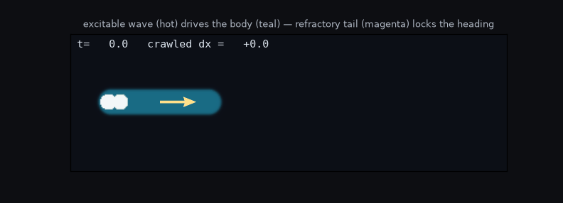
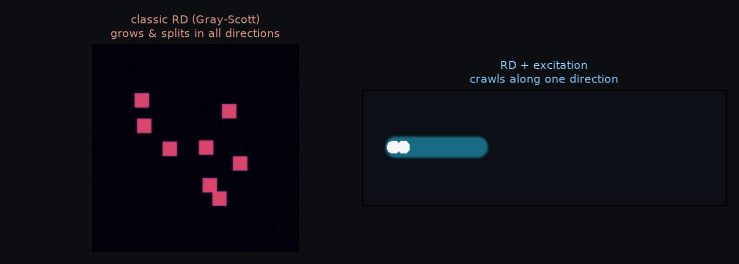
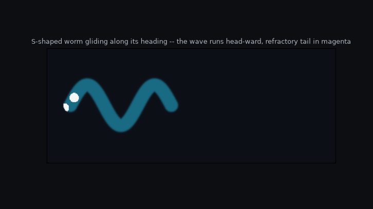
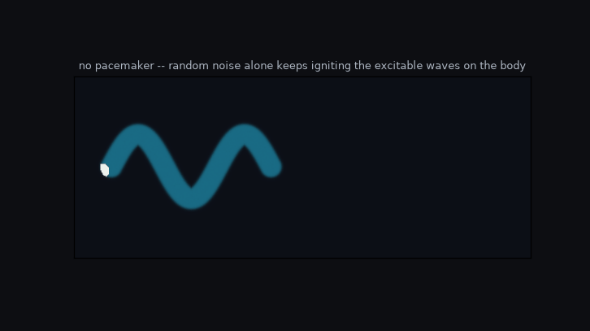
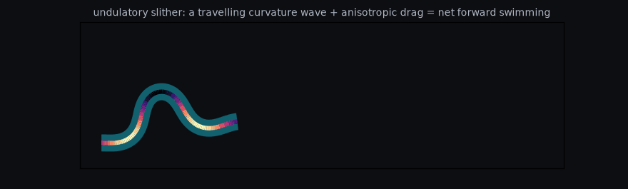

# reaction-diffusion-excitation-worm

A worm that **really crawls in one direction** — not growing isotropically, not
drifting sideways like a wave — built from a reaction–diffusion body coupled to
a self-excitable layer that gives it a *heading*.



*Teal = the worm body. Hot/white = the excitation pulse running head-ward.
Magenta = the refractory tail left behind each pulse. Yellow arrow = the
heading the excitation defines. The worm crawls ~1.5 body-lengths in a straight
line; its centre of mass advances in x while y stays pinned (see `com.png`).*

```
python3 worm.py          # the straight crawler  -> worm_crawl.gif, com.png
python3 compare.py        # classic RD vs this    -> comparison.gif
python3 s_worm.py         # an S-shaped worm      -> worm_s_shape.gif
python3 s_worm.py noise   # noise-ignited waves   -> worm_noise.gif
python3 slither.py        # mass-conserving slither -> worm_slither.gif
```

## The problem

Plain reaction–diffusion gives you only two behaviours, and neither is crawling:

* **Gray–Scott "worms"** grow by tip-splitting and extension — isotropic, no
  persistent heading.
* A **bistable front / stripe travels along its normal**, i.e. *perpendicular*
  to its own long axis — a horizontal stripe drifts up/down, never end-to-end.

Crawling along the body axis needs a **vectorial polarity that is aligned with
the axis, does not reverse, and sustains itself.** A scalar concentration field
can't supply that. That missing ingredient is what the excitable layer provides.

## The idea (this is the whole trick)

Add an **excitable layer** on top of the body. An excitable medium
(FitzHugh–Nagumo / Barkley / neuron / forest-fire — all the same
rested → excited → refractory → recovers cycle) supports a travelling **pulse**
with a **refractory tail**. The refractory tissue behind the pulse *cannot be
re-excited*, so the pulse can never propagate backwards:

> **once a direction is chosen, refractoriness locks it in.**

That is exactly the symmetry-breaking the plain RD worm was missing. Then:

1. **Confine** the excitation to the worm (couple it to the body) → the worm
   becomes a self-organising excitable **waveguide**.
2. A **pacemaker** at the tail fires pulses head-ward (like a central pattern
   generator, or the oscillatory chemistry of a Belousov–Zhabotinsky gel).
3. The pulse defines a **polarity** `P = ⟨−∇v⟩` (it points the way the wave
   goes). The body is **advected** along `P` → the whole worm translocates.

## The model

Three coupled 2-D fields, integrated with explicit finite differences
(9-point isotropic Laplacian, zero-flux boundaries):

| field | meaning |
|-------|---------|
| `phi(x,y)` | the worm **body** — a phase field, ≈1 inside, ≈0 outside |
| `u(x,y)`   | **excitation** (fast activator, Barkley kinetics) |
| `v(x,y)`   | **recovery** (slow inhibitor → the refractory tail) |

**Excitable layer — gated by the body, leaks away outside it:**

```
∂u/∂t = Du ∇²u + φ · u(1−u)(u − (v+b)/a)/ε − k_leak (1−φ) u
∂v/∂t = φ · (u − v)
```

The `φ·(…)` factor makes the kinetics live only inside the worm; the
`−k_leak (1−φ) u` term kills any excitation that leaks outside. So the pulse is
trapped in the body — a waveguide.

**Body — cohesion + area conservation + advection along the heading:**

```
P  = ⟨−∇v⟩  over the pulse           (unit heading vector)
V  = v_crawl · activity · P          (crawl velocity)
∂φ/∂t = Dφ ∇²φ + φ(1−φ)(φ − ½ + μ(A₀−A)/A₀) − V·∇φ
```

The double-well term `φ(1−φ)(φ−½)` keeps the interface sharp; `μ(A₀−A)/A₀`
conserves the worm's area; `−V·∇φ` translates the body in the heading
direction. Keeping the line tension `Dφ` low means the worm glides as a
coherent capsule instead of rounding into a blob.

**Pacemaker:** every `pace_every` steps a pulse is injected in the rear-most
slice of the body, re-arming the wave train that drives the crawl.

## Why it does what the plain worm couldn't

* **Direction is chosen and then locked** — the refractory tail (magenta in the
  GIF) forbids back-propagation, so the heading is stable.
* **The wave stays inside the worm** — the `φ`-gating + leak make the body its
  own waveguide; the pulse never escapes into empty space.
* **Net translocation** — because the body is advected along the (persistent,
  one-way) polarity, the centre of mass moves; it doesn't just pulse in place or
  grow in all directions.

Set `v_crawl = 0` and you recover a stationary worm with a wave running through
it; turn it back up and the same wave now carries the body forward.

## Things to try (knobs in `class P`)

* `v_crawl` — crawl speed (0 = wave only, no motion).
* `pace_every` — pulse frequency; fewer pulses → more inch-worm-like motion.
* `eps`, `a`, `b` — Barkley excitability (pulse speed/width; `b<0` makes a region
  self-oscillate, a built-in pacemaker).
* `Dphi`, `mu` — body line tension and area stiffness (too high → it rounds into
  a blob; too low → it frays).
* `k_leak` — how tightly the excitation is confined to the body.

## Where this lives in the literature

The architecture (a phase-field domain + an internal excitable RD layer that
sets polarity and drives motion) is the same one used for real directed motion:

* **Phase-field cell-motility models** (Shao–Levine–Rappel; Ziebert–Aranson).
* **Excitable actin networks** driving cell crawling (Devreotes–Iglesias
  "biased excitable network").
* **Dictyostelium** cAMP waves guiding directed movement.
* **Belousov–Zhabotinsky self-oscillating gels** (Yoshida) — chemical excitable
  waves producing worm-like peristaltic locomotion in the lab.
* **Min** protein oscillations in *E. coli* — RD that defines spatial polarity.

## Classic RD worm vs. this one (`compare.py`)



Left: **Gray–Scott** in its "worms" regime — the canonical RD worm. It grows,
branches and splits in *all* directions; it is a spreading colony with no
heading. Right: the **excitable-layer worm** — the extra field gives it a
polarity, so it travels along its own axis. Same reaction–diffusion idea; the
excitation is the one ingredient that converts undirected growth into a crawl.

## Variations (`s_worm.py`)

**S-shaped / serpentine worm** — the body is an S-tube driven by the same
heading the straight worm uses, so it **glides** decisively along its long axis
(centre of mass advances ~one body-length) while the wave train runs head-ward
through the curve, each pulse trailing a refractory tail.



*This is gliding along the heading, not yet true undulatory slithering. A free
body that merely undulates in empty space cannot net-translocate: if you drive
it by the purely local velocity `V = c(−∇v)`, the recovery gradient flips sign
across each pulse and the forward/back pushes cancel (≈ the reason real snakes
need **anisotropic friction** — grip sideways, slip forward — to advance). Giving
the body one coherent heading sidesteps that and makes it move.*

**Random noise** (`python3 s_worm.py noise`) — turn the pacemaker off and add a
stochastic kick to the excitation. Above a small threshold the noise
**spontaneously nucleates the waves itself** (you can watch target waves ignite
at random points), so the explicit pacemaker isn't fundamental.



## True slithering, with mass conserved (`slither.py`)

A fair worry about the crawler/glide: is the "movement" just **balanced growth
and decay** — phase appearing at the head and vanishing at the tail — rather than
the *same* body actually relocating? In the phase-field models the interface does
move partly through a reaction term (local birth/death at the edge), kept
globally balanced by the area term; total mass drifts only ~1–6 %, but locally
there *is* turnover.

`slither.py` removes that ambiguity. The body is a fixed-length filament — **no
growth or decay term anywhere** — that undulates via a travelling curvature wave
(the excitable "muscle"/CPG signal) and is propelled by **anisotropic drag**
(it slips along its length easily, sideways with difficulty), solved force- and
torque-free each instant (resistive-force theory). It is the *same* material the
whole time:

```
net displacement = 1.70 body-lengths
body length (≡ mass): change = 0.000 %     # exactly conserved
```



This is the honest test of locomotion: the worm moves a real distance while its
total mass never changes. (Drop the drag anisotropy — make sideways and
lengthwise drag equal — and the net displacement collapses to ~0: a free body
undulating in empty space cannot move, exactly as expected.)

## Is it really *just* reaction–diffusion?

Essentially yes — the core is three coupled fields:

* `phi` (body) — a reaction–diffusion / phase-field PDE,
* `u` (excitation) — a reaction–diffusion PDE (Barkley), gated by `phi`,
* `v` (recovery) — a relaxation equation (no diffusion → a local ODE per point).

The excitable layer is itself reaction–diffusion, so at heart this is **RD for
the body + an RD excitable layer + its recovery variable**, coupled locally
(`u,v` gated by `phi`; the body advected by `−∇v`).

In full honesty, the *first* version (`worm.py`) adds two conveniences that are
**not** pure local PDE terms:

1. a **discrete pacemaker** — a periodic stimulus injected at the tail, and
2. a **global heading read-out** — it integrates `−∇v` over the whole worm to
   get one polarity vector and advects the body rigidly by it.

The pacemaker (1) is genuinely avoidable: the **noise** demo replaces it with a
stochastic term that lets the medium ignite its own waves. The heading read-out
(2) is the one ingredient that is honestly *not* a local PDE term. You *can*
write a purely local drive `V = c(−∇v)`, but it cannot net-propel a free
undulating body (the sign-cancellation above) — so a decisive crawl needs either
this global read-out or an explicit substrate/friction term. So the fairest
summary is: **RD body + RD excitable layer + recovery, plus one non-local
heading read-out** (and the pacemaker can be pure noise).
